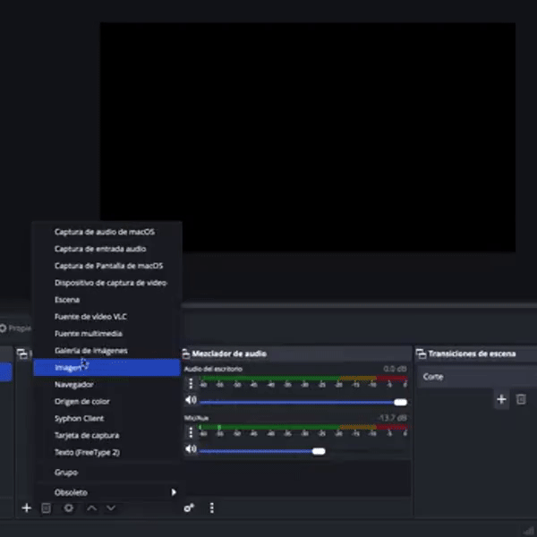
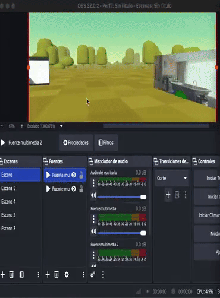

# 🎥 Comunicación Multimedia en Realidad Extendida  
### Trabajo de Fin de Grado 

Este repositorio contiene la implementación completa del Trabajo de Fin de Grado **“Comunicación multimedia en realidad extendida”**, cuyo objetivo principal es explorar y diseñar un sistema capaz de **integrar vídeo, audio y comunicación en tiempo real dentro de entornos 3D interactivos basados en WebXR y A-Frame**.

El proyecto aborda dos **casos de uso fundamentales**:

---

## 🟦 Caso de uso 1: Visualización multimedia y retransmisión hacia OBS

Este caso de uso muestra cómo integrar vídeos, cámara del usuario y contenido tridimensional dentro de una escena A-Frame, y cómo transmitir dicha escena en tiempo real a **OBS Studio** mediante un servidor WHIP desarrollado en Python.

La escena funciona **por sí sola**, sin necesidad de OBS ni del servidor WHIP.  
La integración con OBS es **opcional** y solamente se requiere si deseas retransmitir la escena o utilizarla como fuente de vídeo en directo.

---

# 🌐 1. Ejecutar la escena desde GitHub Pages (sin instalación)

La escena puede visualizarse directamente desde:

👉 **https://pclarke17.github.io/TFG/Caso_1

Esto permite:

- reproducción de vídeos como texturas 3D  
- visualización de la cámara del usuario dentro de la escena  
- navegación libre en un entorno WebXR  

⚠️ **IMPORTANTE:**  
La retransmisión hacia OBS no funciona desde GitHub Pages.  
Para ello es necesario ejecutar el servidor WHIP en local (ver sección 3).

---

# 2. Ejecutar el Caso de Uso 1 en local

Para lanzar la escena con todas sus funciones:

### ✔ Servir la escena A-Frame

La escena se puede servir desde la propia URL de GitHub Pages.

# 3. Generar certificados HTTPS (requerido SOLO si quieres usar OBS)

El servidor WHIP funciona exclusivamente por HTTPS, ya que WebRTC no permite conexiones inseguras fuera de localhost.

Para ejecutarlo, necesitas generar un certificado autofirmado:

openssl req -x509 -newkey rsa:2048 -keyout key.pem -out cert.pem -days 365 -nodes

Esto creará:

cert.pem

key.pem

Colócalos dentro del archivo whip_server.py y en la misma carpeta donde se encuentre el archivo:

  # HTTPS con la ruta de tus certificados
    ssl_ctx = ssl.SSLContext(ssl.PROTOCOL_TLS_SERVER)
    ssl_ctx.load_cert_chain(
        "/Users/pabloclarke/Documents/TFG/Video/cert.pem",
        "/Users/pabloclarke/Documents/TFG/Video/key.pem"
    )
    
✔ Si NO deseas enviar la escena a OBS:

No necesitas generar certificados ni ejecutar el servidor WHIP.

# 4. Arrancar el servidor WHIP (opcional)

Si deseas enviar vídeo a OBS, ejecuta:

python3 whip_server.py


En el terminal deberías de ver: 

🚀 WHIP HTTPS escuchando en https://0.0.0.0:8080/whip
💾 Enviando señal en vivo a OBS por UDP → udp://127.0.0.1:6000


Este servidor recibe la señal WebRTC de A-Frame, la procesa y la reenvía a OBS en formato MPEG-TS.

# 5. Configurar OBS Studio (opcional)

Solo necesario si quieres transmitir la escena.

Añadir fuente → Captura de entrada multimedia

Elegir Red (URL)

Introducir:

udp://127.0.0.1:6000


Ajustar búfer (200–400 ms recomendado)



Si todo está configurado correctamente, la cámara del usuario, los vídeos 3D y el entorno de la escena aparecerán en OBS en tiempo real.



(Si la escena no se ve en OBS y está todo corriendo, refresca la página donde estes lanzando la escena)

--------------------------------------------------------------------------------------------------------------------------------------------------------------

# 🔗 WebRTC + Videoconferenecia en A-Frame

Este proyecto permite realizar una **videollamada bidireccional** entre dos usuarios utilizando **WebRTC** y visualizando el vídeo dentro de una escena **A-Frame** en 3D/VR.


## ¿Cómo funciona?

1. **Captura del vídeo y audio local** con `getUserMedia()`.
2. Se crea una conexión `RTCPeerConnection` y se usa **WebSocket** para intercambio de señales (SDP/ICE).
3. El vídeo local se asigna a una textura sobre un `<a-plane>` en A-Frame.
4. El vídeo remoto se recibe, se dibuja en un `<canvas>`, y ese canvas se usa como textura para otro `<a-plane>`.
5. Se crea una experiencia inmersiva estilo "reunión en el metaverso".

## Estructura del Proyecto

```
📁 videoconferencia-webrtc/
├── index.html              # Escena A-Frame con planos de video local y remoto
├── webrtc.js               # Lógica WebRTC + conexión WebSocket + texturizado
├── server.js               # Servidor WebSocket seguro (WSS) con Node.js
├── cert/                   # Certificados auto-firmados para HTTPS/WSS
│   ├── cert.pem
│   └── key.pem
```

## Requisitos

- Node.js (v16+)
- HTTPS local habilitado (auto-signed certificate)
- Navegadores compatibles con WebRTC: Chrome, Firefox, Edge...

## Cómo iniciar

```bash
# Instala dependencias (si usas express o similar)
npm install

# Lanza el servidor seguro
node server.js
```

Abre en el navegador:

```
https://<tu-ip-local>/
```

Ejemplo:

```
https://192.168.1.141/
```

Luego abre otro dispositivo/navegador con la misma URL.

## 🎮 Controles

- ✅ Transmisión de cámara y micrófono.
- 🎥 Los vídeos se renderizan en planos 3D dentro de la escena A-Frame.
- 🔊 El audio se reproduce desde los elementos de video automáticamente.

## 📸 Técnicas usadas

| Tecnología | Rol |
|-----------|------|
| WebRTC    | Comunicación P2P de audio/vídeo |
| WebSocket | Canal de señalización (SDP, ICE) |
| A-Frame   | Motor VR para visualización 3D de la videollamada |
| HTML5 Video & Canvas | Captura de vídeo y texturizado |
| HTTPS + WSS | Comunicación segura necesaria para WebRTC en producción |

## 🛡️ HTTPS/WSS en local

Usamos un certificado auto-firmado para desarrollo:

```js
// server.js (extracto)
const server = https.createServer({
  key: fs.readFileSync("./cert/key.pem"),
  cert: fs.readFileSync("./cert/cert.pem"),
}, app);

const wss = new WebSocket.Server({ server });
```

Puedes generarlo con:

```bash
mkdir cert
openssl req -x509 -newkey rsa:4096 -keyout cert/key.pem -out cert/cert.pem -days 365 -nodes
```

## Qué esperar una vez dentro de la escena.

Una vez se acceda a la escena, nos encontraremos con distintos botones de carácter HTML, en los que podremos apagar/encender el micrófono y la cámara, elegir qué cámara se va a transmitir y con la que el otro usuario nos verá y elegir el fondo de la escena 3D.


En cuanto a las cámaras, tendremos dos disponibles, la cámara de la escena y la webcam del navegador. Este punto está pensado para dispositivos donde no se puede acceder a sus cámaras propias, como es el caso de las gafas de realidad virtual Meta Quest 3, donde se realizaron las pruebas de visionado de la escena.

---

##  Componentes principales del repositorio

El proyecto se estructura en diversos módulos coherentes con la memoria:

- **`video-canvas-texture.js`**  
  Permite usar vídeos locales o remotos como texturas dinámicas.

- **`camera-canvas-texture.js`**  
  Captura la cámara del usuario y la integra en la escena como textura.

- **`OBS.js`**  
  Captura el punto de vista del usuario y establece una sesión WHIP para enviar vídeo hacia OBS.

- **`whip_server.py`**  
  Servidor Python basado en `aiortc` y `PyAV` que recibe flujos WebRTC y los retransmite a OBS mediante MPEG-TS/UDP.

- **`index.html`**  
  Escena de demostración que integra todos los componentes del sistema.

---

##  Tecnologías utilizadas

- **A-Frame** y **Three.js** para la construcción de entornos WebXR.  
- **WebRTC** para captura, transporte y comunicación audiovisual.  
- **WHIP (WebRTC-HTTP Ingestion Protocol)** para ingestión del flujo hacia el servidor.  
- **OBS Studio** para visualización y retransmisión.  
- **Python + aiortc + PyAV** para procesar vídeo y reenviarlo como MPEG-TS.  

Estas tecnologías permiten combinar XR, comunicación en tiempo real y producción multimedia en un mismo sistema Web.

---

## 🎯 Finalidad del proyecto

El TFG demuestra cómo es posible **integrar canales multimedia complejos en un entorno XR accesible desde el navegador**, habilitando aplicaciones como:

- Streaming inmersivo  
- Telepresencia 3D  
- Escenarios de producción audiovisual interactiva  
- Espacios colaborativos WebXR con vídeo en tiempo real  

---
